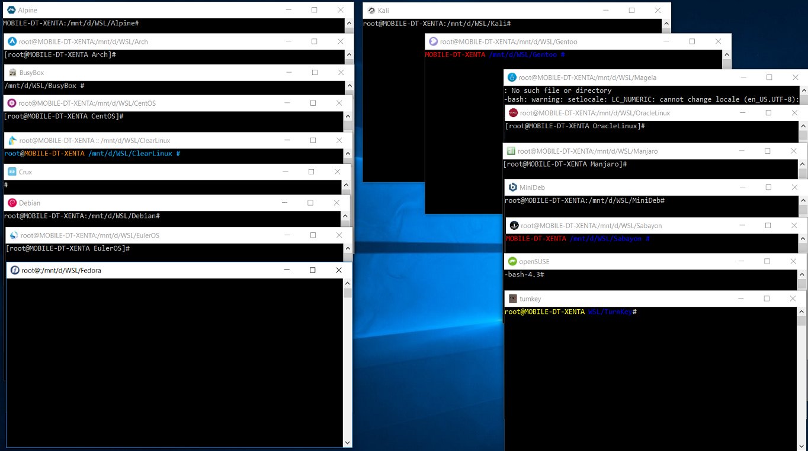

Xenta.Template is a generic project template used as a base for all xenta projects. 

## Continuous integration

| Build server                | Platform     | Build Status Branch - Master                                                                                                                                        | Build Status Branch - DMZ                                                                                                                                           |
|-----------------------------|--------------|---------------------------------------------------------------------------------------------------------------------------------------------------------------------|---------------------------------------------------------------------------------------------------------------------------------------------------------------------|
| AppVeyor                    | Windows      | [](https://ci.appveyor.com/project/mrpastewart/xenta-template/branch/master)   | [](https://ci.appveyor.com/project/mrpastewart/xenta-template/branch/dmz)      |
| Travis                      | Linux / OS X | [](https://travis-ci.org/xentafx/xenta.template)                                     | [](https://travis-ci.org/xentafx/xenta.template)                                        |
| GitLab                      | Windows      | [](https://gitlab.com/xentafx/xenta.template/commits/master)                   | [](https://gitlab.com/xentafx/xenta.template/commits/dmz) &nbsp;                  |

### Preview of any media used in the project i.e screenshots, video


## Table of Contents

- [Introduction](#introduction)
    - [Project Goals](#project-goals)
    - [OSS Projects Used](#oss-projects-used)
    - [Project Structure](#project-structure)
- [Installation](#installation)
    - [Requirements](#requirements)
    - [Deployment](#deployment)
    - [Developers](#developers)
- [Developers Setup](#development-setup)
    - [Base Setup](#base-setup)
    - [Addon Setup](#addon-setup)
    - [Extension Packs](#extension-packs)
    - [Extending Psito](#extending-psito)
- [Configurations](#configurations)
    - [IDE Packages](#ide-packages)
    - [Scripts](#scripts)
    - [Config Files](#config-files)
    - [Project Sources](#project-sources)
- [Contributions](#contributions)
- [License](#license)
- [Links](#links)

## Introduction

Give a introduction of the project.

### Project Goals

State the goals and mission of the project

### OSS Projects Used

The {NAME} Project attempts to combine the best in class open source projects that provide meaningful usage within our project scope. The following OSS projects have been chosen for inclusion.

**This list is a moving target and may be updated as the project moves forward to add or delete projects as the needs become clearer.**

### Project Structure

Downloading the source distribution from Github creates the following file structure;
````
{root}
  +-- base
  +-- config
  +-- doc
  +-- include
  +-- scripts
  +-- spike
  +-- src
  |    +-- main.c
  +-- test
  +-- <.editorconfig>>
  +-- <.gitattributes>
  +-- <.gitignore>
  +-- <makefile>
  +-- <readme.md>
````

Downloading the release distribution from Github creates the following file structure;
````
{root}
  +-- rootfs.tar.gz
  +-- rootfs
  +-- <ubuntu.exe>
  +-- <license.txt>
  +-- <versions.txt>
````

## Installation

### Requirements

### Deployment

### Developers

## Developers Setup

### Base Setup

### Addon Setup

### Extension Packs

### Extending Psito

## Configurations

### IDE Packages

### Scripts

### Config Files

### Project Sources

## Contributions

## License

Copyright 2000 - 2017 Xenta SocialLabs

Licensed under the Apache License, Version 2.0 (the "License"); you may not use this file except in compliance with the License. You may obtain a copy of the License at:

http://www.apache.org/licenses/LICENSE-2.0

Unless required by applicable law or agreed to in writing, software distributed under the License is distributed on an "AS IS" BASIS, WITHOUT WARRANTIES OR CONDITIONS OF ANY KIND, either express or implied. See the License for the specific language governing permissions and
limitations under the License.

## Links
